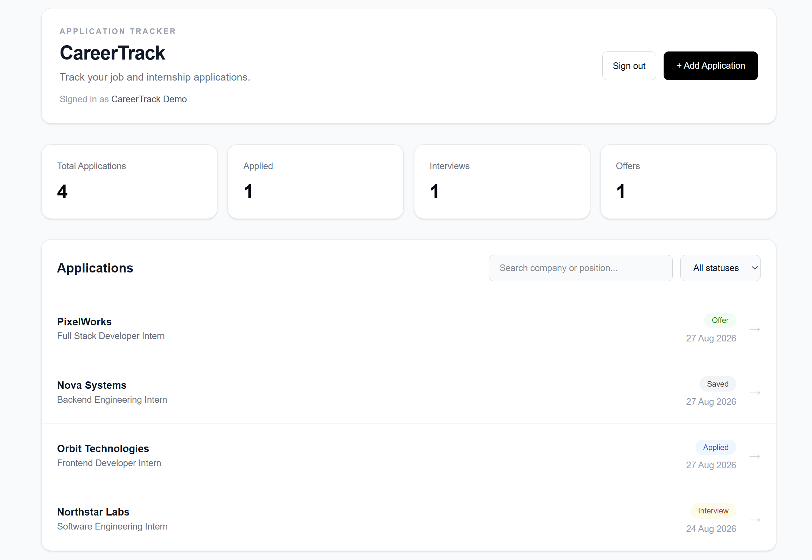
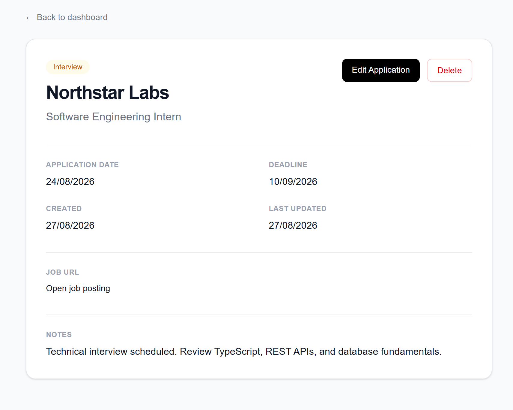
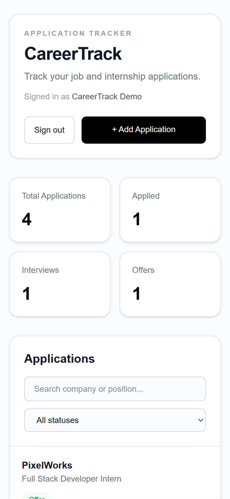
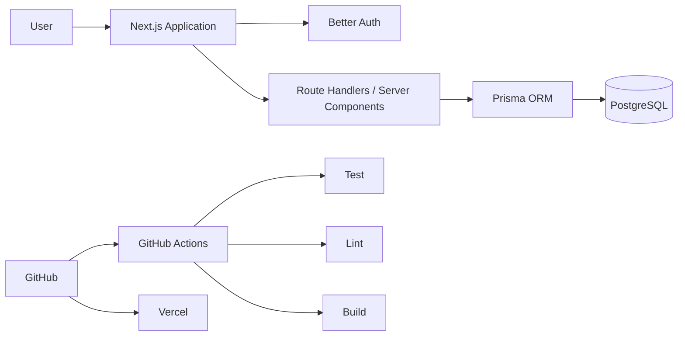

# CareerTrack

A full-stack job and internship application tracker for organizing and managing the application process in one place.

[Live Demo](https://careertrack-eight.vercel.app)

CareerTrack allows users to securely create and manage their own job or internship applications, track each application's status, store important dates and notes, and quickly search or filter their application history.
## Preview



## Features

- Email and password authentication
- User-specific application ownership and authorization
- Create, view, edit, and delete applications
- Track application status: Saved, Applied, Interview, Offer, or Rejected
- Search applications by company or position
- Filter applications by status
- Store job URLs, application dates, deadlines, and notes
- Responsive desktop and mobile interface
- Custom loading, error, and 404 states
- Server-side input validation
- Automated API and validation tests
- Continuous integration with GitHub Actions
- Production deployment with Vercel and PostgreSQL
## Application Management

Each application has its own detail view for tracking status, important dates, the original job posting, and personal notes.



## Tech Stack

**Frontend**
- Next.js
- React
- TypeScript
- Tailwind CSS

**Backend**
- Next.js App Router and Route Handlers
- Better Auth
- Prisma ORM

**Database**
- PostgreSQL
- Prisma Postgres

**Testing & DevOps**
- Vitest
- ESLint
- GitHub Actions
- Vercel
## Responsive Design

CareerTrack is designed to remain fully usable across desktop and mobile screen sizes.

<p align="center">
  
</p>
## Architecture



CareerTrack uses Next.js for both the user interface and server-side application logic. Prisma provides the database layer, while PostgreSQL stores users, sessions, and application data.

## Authentication & Ownership

Authentication is handled with Better Auth.

Applications are linked to a required user account, and protected operations verify the current session and application ownership before allowing access or modification.

This prevents one user from reading, editing, or deleting another user's applications.

## Testing & CI

CareerTrack currently includes **15 automated tests** covering core validation and authorization behavior.

The test suite covers areas such as:

- required application fields
- application status validation
- URL validation
- date validation
- unauthenticated API requests
- authenticated application creation
- user ownership checks
- update authorization
- delete authorization

Run the tests locally with:

```bash
npm test
```

GitHub Actions runs the following checks automatically on pull requests and pushes to `main`:

```text
npm test
npm run lint
npm run build
```

This ensures tests, linting, and the production build pass before changes are merged.
## Getting Started

### Prerequisites

Make sure you have the following installed:

- Node.js 20+
- npm
- PostgreSQL

### 1. Clone the repository

```bash
git clone https://github.com/hikmetalpcanova/careertrack.git
cd careertrack
```

### 2. Install dependencies

```bash
npm install
```

### 3. Configure environment variables

Create a `.env` file in the project root:

```env
DATABASE_URL="postgresql://..."
SHADOW_DATABASE_URL="postgresql://..."
BETTER_AUTH_SECRET="your-secure-secret"
BETTER_AUTH_URL="http://localhost:3000"
```

`DATABASE_URL` is used by the application and Prisma to connect to PostgreSQL.

`SHADOW_DATABASE_URL` is used for the local Prisma migration workflow.

Never commit real credentials or secrets to the repository.

### 4. Apply database migrations

```bash
npx prisma migrate dev
```

### 5. Start the development server

```bash
npm run dev
```

Open:

```text
http://localhost:3000
```

## Project Structure

```text
careertrack/
├── app/
│   ├── api/
│   │   ├── applications/
│   │   └── auth/
│   ├── applications/
│   │   ├── [id]/
│   │   └── new/
│   ├── sign-in/
│   ├── sign-up/
│   ├── error.tsx
│   ├── loading.tsx
│   ├── not-found.tsx
│   └── page.tsx
├── components/
├── lib/
├── prisma/
│   ├── migrations/
│   ├── schema.prisma
│   └── seed.ts
├── tests/
├── docs/
│   └── screenshots/
└── .github/
    └── workflows/
        └── ci.yml
```

## Development Workflow

CareerTrack was developed using a feature-branch and pull-request workflow.

```text
feature branch
      ↓
implementation
      ↓
local validation
      ↓
pull request
      ↓
GitHub Actions CI
      ↓
review
      ↓
merge to main
      ↓
Vercel deployment
```

This keeps the `main` branch stable and ensures changes are tested before reaching production.

## What I Learned

Building CareerTrack gave me hands-on experience with the complete lifecycle of a modern full-stack application, including:

- designing and evolving a relational database schema
- working with PostgreSQL through Prisma ORM
- creating and applying database migrations
- implementing authentication with Better Auth
- enforcing server-side resource ownership
- building CRUD APIs with Next.js Route Handlers
- validating and normalizing user input
- writing automated tests for validation and authorization
- mocking authentication and database dependencies in tests
- using Git branches, commits, and pull requests consistently
- configuring continuous integration with GitHub Actions
- managing development and production environment variables
- deploying a full-stack application with Vercel
- connecting a production PostgreSQL database
- testing responsive layouts across desktop and mobile devices
- adding loading, error, and not-found states for production UX

## Future Improvements

Potential improvements after V1 include:

- email verification and password recovery
- end-to-end browser tests
- application analytics and insights
- interview scheduling features
- reminders and notifications
- accessibility auditing
- improvements based on real-user feedback

These features are intentionally outside the initial V1 scope so the first release remains focused and complete.

## Status

CareerTrack is deployed and functional in production.

**Current stable release: v1.0.0**

---

Built by [Hikmet Alp Canova](https://github.com/hikmetalpcanova)